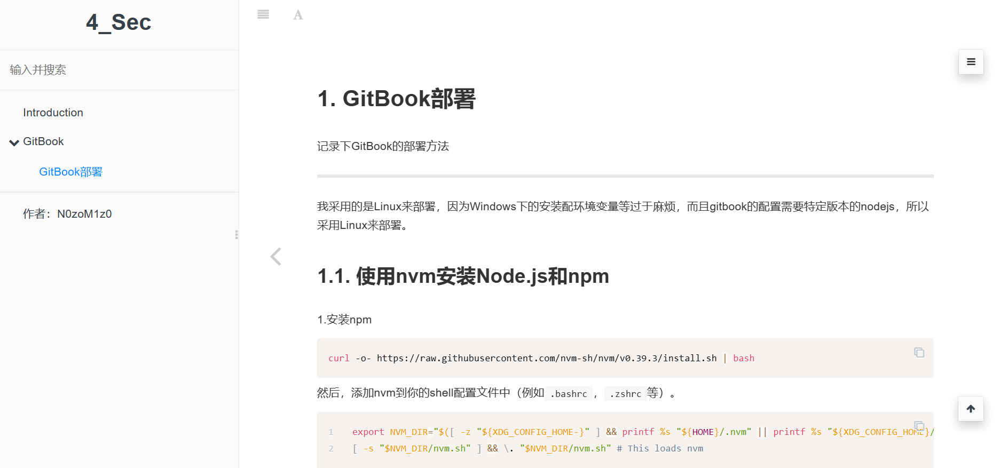
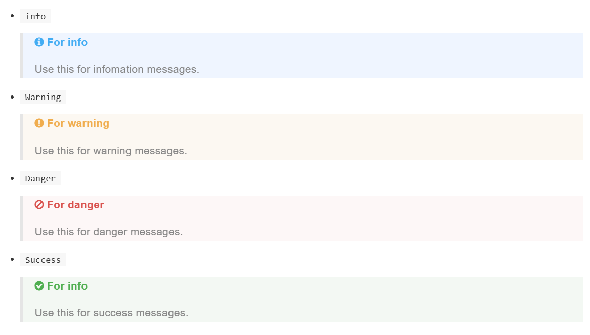
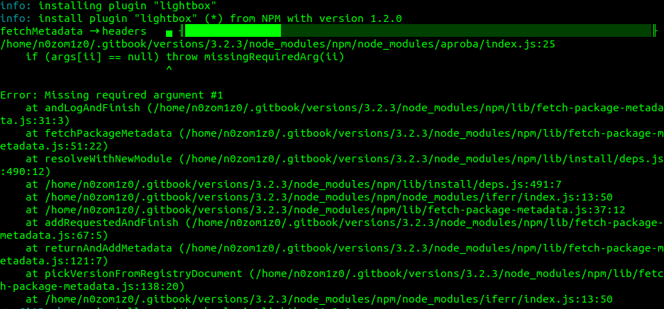
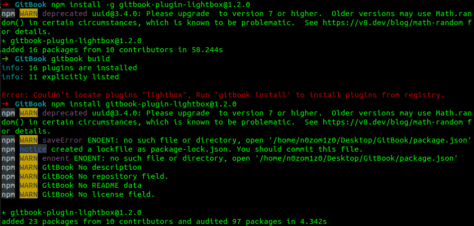
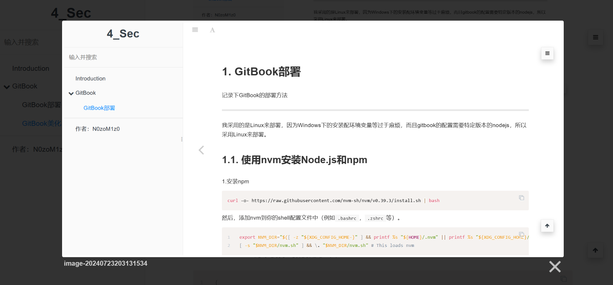

# GitBook美化

相比较github.io的博客形式，我觉得这种book形式的更加好看。

安装一些实用的插件。


## 插件安装方法

在book的根目录下建一个`book.json`文件，按着配置，这里以[GitBook安装及使用——使用 Markdown 创建你自己的博客网站和电子书_gitbook搭建-CSDN博客](https://blog.csdn.net/qq_33697094/article/details/135090645)上面给的book.json为例，也是我的初始化book.json配置。

```json
{
    "language" : "zh-hans",
    "structure": {
        "readme": "README.md"
    },
    "plugins": [
        "-lunr",
		"-sharing",
        "-search",
        "search-pro",
		"sidebar-style",
		"code",
		"splitter",
		"expandable-chapters",
		"anchor-navigation-ex",
		"-highlight",
		"prism", 
		"popup"
    ],
    "pluginsConfig": {
		 "sidebar-style": {
            "title": "4_Sec",
            "author": "N0zoM1z0"
        }
    }
}
```

整体效果还是蛮好看的，




## 继续安装插件/美化

给几个参考文章：

- [Gitbook详解（五）-插件的配置和使用详解 - 简书 (jianshu.com)](https://www.jianshu.com/p/7b6ece9fbdf2)
- [plugin - gitbook常用的插件 - 个人文章 - SegmentFault 思否](https://segmentfault.com/a/1190000019806829)
- [gitbook部署网站 · sqlfans](https://wiki.sqlfans.cn/linux/linux-app-gitbook.html)


对一些实用的美化插件用法作个记录：


### `alerts` 漂亮格式的提示块

```json
{
    "plugins": ["alerts"]
}
```

目前支持 4 种提示的类型：`info`，`warning`，`danger`，`success`

```markdown
Info styling

> **[info] For info**
>
> Use this for infomation messages.

Warning styling

> **[warning] For warning**
>
> Use this for warning messages.

Danger styling

> **[danger] For danger**
>
> Use this for danger messages.

Success styling

> **[success] For info**
>
> Use this for success messages.
```

分别展示如下。

- `info`

  > **[info] For info**
  >
  > Use this for infomation messages.

- `Warning`

  > **[warning] For warning**
  >
  > Use this for warning messages.

- `Danger`

  > **[danger] For danger**
  >
  > Use this for danger messages.

- `Success`

  > **[success] For info**
  >
  > Use this for success messages.

效果还是不错的。




### `lightbox` 点击图片弹窗显示

这个也是必须的优化插件了。

```json
{
    "plugins": [
        "lightbox"
    ],
    "lightbox": {
        "includeJQuery": false,
        "sameUuid": true,
        "options": {
            "resizeDuration": 500,
            "wrapAround": false
        }
    }
}
```

那么就需要把前面book.json的`popup`插件去掉，不然两者冲突了。（一个弹窗显示，一个在新页面显示）

但是，貌似这个版本的gitbook安装lightbox有问题。（已解决）

> **[warning] 错误安装方式**
>
> ```bash
> gitbook install
> ```
>
> 


> **[success] 正确安装方式**
>
> Almighty GPT4~
>
> ```bash
> # 全局安装插件
> npm install -g gitbook-plugin-lightbox@1.2.0
> # 在项目中安装插件
> npm install gitbook-plugin-lightbox@1.2.0
> ```
>
> 


效果：




### `hide-element` 隐藏元素

可以隐藏不想看到的元素，比如导航栏中 `Published by GitBook` 。

```json
{
    "plugins": [
        "hide-element"
    ],
    "pluginsConfig": {
        "hide-element": {
            "elements": [".gitbook-link"]
        }
    }
}
```


### `prism` 代码高亮美化

直接看official document吧

https://github.com/gaearon/gitbook-plugin-prism?tab=readme-ov-file

测试代码段：

```c
#include<malloc.h>
int main(){
	char *A = malloc(0x10);
	free(A);
	if(0){;}
	return 0;
}
```

```python
import os
print(os.popen("whoami").read())
```

```bash
gcc -m32 -g test.c -o test
```


比较喜欢这一款：`prismjs/themes/prism-tomorrow.css`


### `favicon` 修改网站的favicon.ico

```json
{
    "plugins": ["favicon"],
    "pluginsConfig": {
      "favicon": {
            "shortcut": "asset/img/favicon.ico",
            "bookmark": "asset/img/favicon.ico",
            "appleTouch": "asset/img/favicon.ico",
            "appleTouchMore": {
                "120x120": "asset/img/favicon.ico",
                "180x180": "asset/img/favicon.ico"
            }
        }
    }
}
```

**注意：**

1. 图标的格式一定要是`.ico`的，**直接修改图片的后缀为`.ico`是无效的**。
2. 图标的分辨率要是**32*32**的。
3. 可在线把图片转成图标：[http://www.bitbug.net/](https://link.segmentfault.com/?enc=5ZzaHeWCRdvzNw88hQzRnQ%3D%3D.IIj3YAFwZwy1VJYwjJPz3mjjJ%2BHs49NF%2BKd0Nw%2BGHmk%3D)


### `tbfed-pagefooter` 添加页面显示最后更新时间

也是有必要的一个插件。

```json
{
    "plugins": [
        "tbfed-pagefooter"
    ],
    "pluginsConfig": {
        "tbfed-pagefooter": {
            "copyright":"",
            "modify_label": "该文件最后修改时间：",
            "modify_format": "YYYY-MM-DD HH:mm:ss"
        },
    }
}
```

